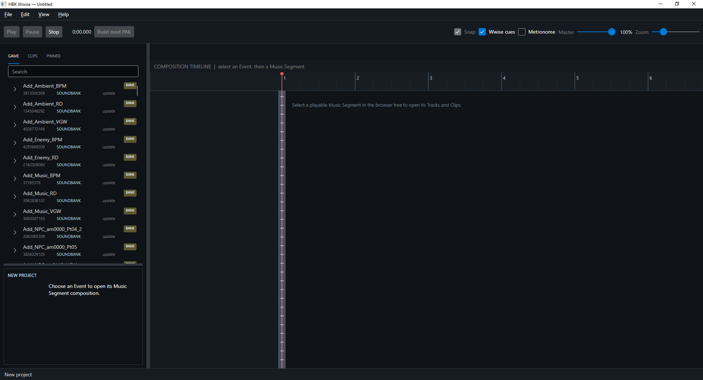
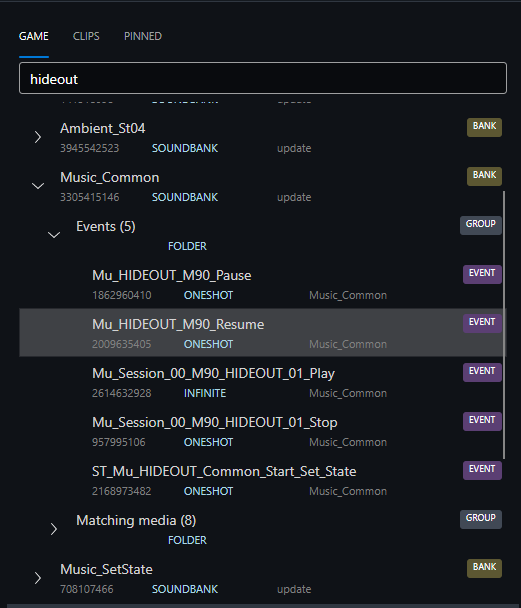
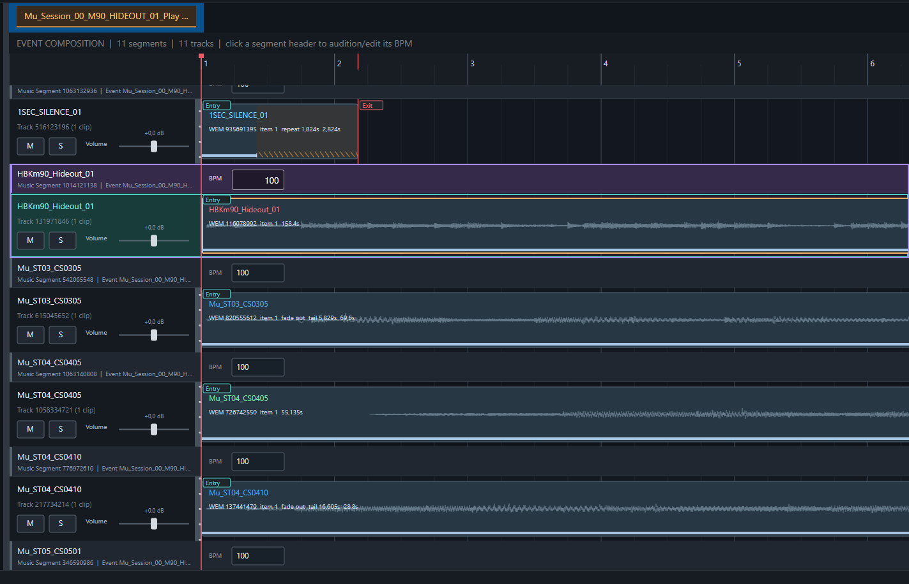
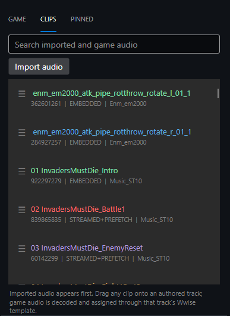
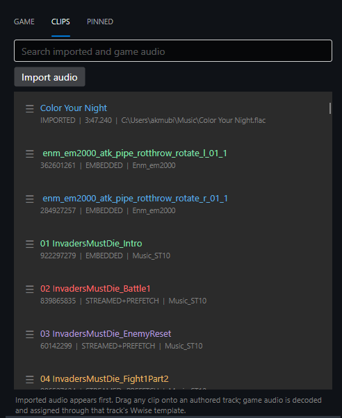
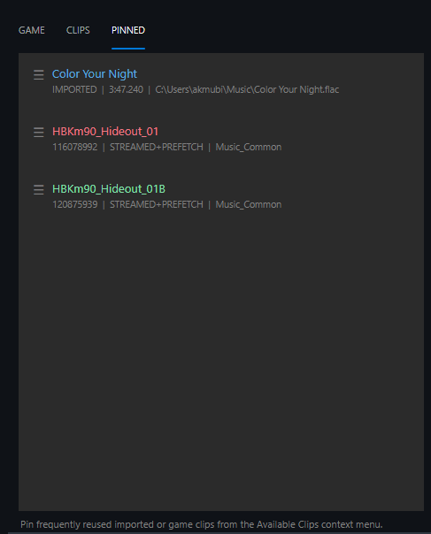
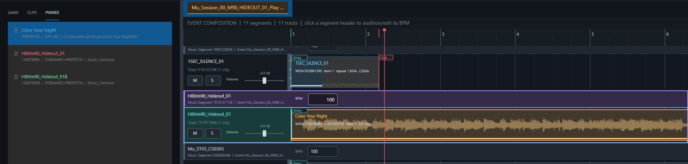

# HBK Wwise

[](https://github.com/akmubi/HbkWwise/actions/workflows/tests.yml)
[](https://github.com/akmubi/HbkWwise/actions/workflows/release.yml)

HBK Wwise is a Windows editor for making Hi-Fi RUSH audio mods.

You do not edit the game's PAK files directly. HBK Wwise reads the installed game, shows its Wwise SoundBanks and audio in a browser, lets you arrange replacement audio on a timeline, and then builds a separate mod PAK containing only the files you changed.



## What the important words mean

If you have never used a Wwise modding tool before, these are the only terms you need to know at first:

- **Game PAKs** are the archives installed with Hi-Fi RUSH. HBK Wwise reads them but does not modify them.
- A **SoundBank** (`.bnk`) contains Wwise objects that describe how the game plays audio.
- A **WEM** is a Wwise audio file.
- An **Event** is something the game triggers in Wwise, for example a music event. Opening an Event is usually how you get to the music you want to edit.
- The **game index** is a JSON file generated by HBK Wwise. It is a catalog of the game's SoundBanks, WEMs, Events, and their locations. Generating it does not modify the game.
- An **HBK Wwise project** saves your editing work so you can come back to it later.
- A **mod PAK** is the final file you install as a mod. It contains only the changed SoundBanks and the WEMs needed by those changes.

## Requirements

You need:
- Base game installed.
- [overdub](https://github.com/akmubi/overdub) mod loader.
- [Wwise](https://www.audiokinetic.com/en/) **`2019.2.15.7667.2164`**.
- [Python 3 (>=3.8)](https://www.python.org/downloads/release/python-3820/).

## Installation

### installation

1. Download the latest `HbkWwise-<version>-Setup.exe` release.
2. Run the installer.
3. Start **HBK Wwise**.

## First-time setup

1. Launch the game with `overdub` installed.
2. At title screen open console (`F1`), scroll up and find & copy dumped AES key.
3. Start HBK Wwise.
4. Paste the AES key.

## Basic workflow

### 1. Find the music

Use the browser on the left side of the main window to find a SoundBank and an Event.



Open an Event. HBK Wwise analyzes the Event and opens a timeline tab containing the music segments and tracks it can resolve from that Event.



If you do not know the exact Event, use search. Searching by SoundBank name, Event name, media name, or known Wwise ID is usually faster than opening everything manually.



### 2. Choose replacement audio

You can use either:
- audio already found in the game index, or
- a local audio file that you import into the project.



The **CLIPS** area is useful for finding game audio and reusing clips. Pin clips that you expect to use repeatedly.



### 3. Put audio on the timeline

Drag the replacement audio onto the track you want to change.

On the timeline you can:

- move clips;
- trim clips;
- split clips;
- adjust fades;
- adjust Wwise synchronization cues;
- change segment BPM;
- mute or solo tracks;
- preview the result before building anything.



### 4. Save the project

Use **File -> Save project**.

The project file stores your HBK Wwise editing state. It is not the mod and it does not change the game.

Save the project if you plan to come back and keep editing later.

### 5. Build the mod PAK

Click **Build mod PAK** when the preview is how you want it.

HBK Wwise then:

1. extracts the original SoundBank that needs to be changed;
2. applies your timeline and media changes;
3. converts replacement WAV, MP3, FLAC, or OGG audio to WEM when needed;
4. writes the changed SoundBank and replacement media into a new PAK;
5. leaves the original game PAKs untouched.

The resulting `.pak` is the mod file. Copy it into `<path-to-game>\Hibiki\Content\Paks\`, so `overdub` will load it.

## Keyboard shortcuts

| Shortcut      | Action                                                                  |
| ------------- | ----------------------------------------------------------------------- |
| `Ctrl+C`      | Copy selected text, or copy the selected clip when no text is selected  |
| `Ctrl+V`      | Paste copied clip                                                       |
| `S`           | Split selected clip                                                     |
| `Alt+Mouse`   | Drag/move a clip                                                        |
| `Shift+Mouse` | Select a timeline range                                                 |
| `Ctrl+Mouse`  | Trim a clip edge                                                        |
| `Ctrl+Tab`    | Move between timeline tabs                                              |
| `Ctrl+W`      | Close the current timeline tab                                          |
| `Delete`      | Delete selected clip                                                    |
| `Space`       | Toggle playback                                                         |
| `Right-click` | Open context menu                                                       |
| `R`           | Return the playhead to the beginning and center the timeline view on it |
| `F`           | Center the timeline view on the red playhead                            |

## Where HBK Wwise stores its own files

Preferences and caches are stored under:

```
%LOCALAPPDATA%\HbkWwise
```

Your generated index, project files, imported audio, and built mod PAKs are saved wherever you choose in the file dialogs.

## Building from source

```powershell
dotnet build .\HbkWwise.sln
dotnet test .\HbkWwise.sln
dotnet run --project .\src\HbkWwise.Gui
```

HBK Wwise is MIT licensed. See `LICENSE.txt` and `THIRD-PARTY-NOTICES.txt`.
